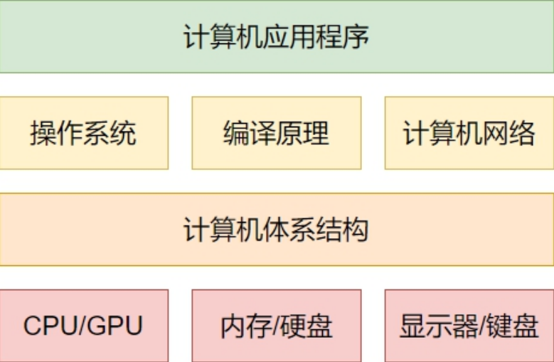
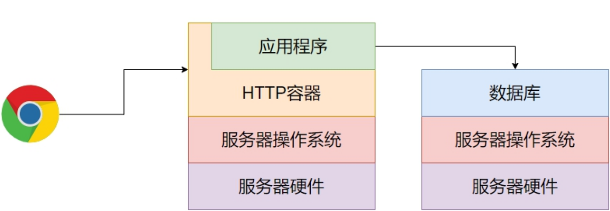

## 编程语言的发展历史

我们的手机、电脑、平板上使用的应用软件，包括操作系统，都是通过编程语言编写程序实现的，编程语言经历了三代的发展历程.

1. 第一代编程语言——机器语言

   所谓机器语言，就是0和1组成的字符序列，它复杂、难以阅读和记忆，且不同处理器架构的指令集存在差异(x86和ARM)，但是直接操作硬件，运行快，效率高.

2. 第二代编程语言——汇编语言

   汇编语言，是为了解决机器语言难以阅读和记忆而产生的，它将0和1组成的字符序列替换成了助记符，例如add、sub等，但不同处理器架构的汇编语言的语法格式不同，仍无法屏蔽底层硬件的差异.

3. 第三代编程语言——高级语言

   高级语言又包括两个分支：面向过程、面向对象.

   1. 面向过程的高级语言

      C、Basic ...

   2. 面向对象的高级语言

      C++、Java、Python、C#、golang ...

   高级编程语言贴近自然语言，符合人的思维方式，不直接操作硬件，可以屏蔽底层硬件的差异，具备可移植性.

   那么高级语言是如何转化为机器语言转交机器执行的呢？换句话说，它的可移植性是怎么实现的?

   以C语言为例子来说，C程序的执行会经历下面这个过程：

   

   其中，编译器会将高级语言编译成当前机器处理器架构的汇编语言，汇编器又会将汇编语言汇编成当前CPU所能识别的机器指令，而在这个过程中，编译器和汇编器调用的都是操作系统底层的API，也就是说，是操作系统屏蔽了底层硬件的差异，实现了高级语言程序的可移植性.

## 操作系统

一张典型的图片：

操作系统的作用？为什么需要操作系统？

1. 对下，屏蔽底层硬件的差异，实现应用程序的可移植.
2. 对上，负责内存管理、文件管理、任务调度、资源分配等工作，为上层应用程序的稳定运行提供服务保障.
3. 可以提供图形化操作界面，方便用户使用.

## 个人电脑操作系统

微软系列：DOS、Windows 95、Windows XP、Windows 7、Windows 10 ...

Linux系列：Ubuntu ...

苹果系列：MacOS ...

## 服务器操作系统

微软系列：Windows Server ...

Linux系列：RedHat、CentOS ...

## 扩展：服务器

软件有两种架构：C/S架构(客户端/服务器)、B/S架构(浏览器/服务器).

比较：

1. C/S架构需要手动安装和维护，而B/S架构不需要.
2. C/S架构占用资源多，B/S架构占用资源少.
3. C/S架构不能跨操作系统，B/S架构可以跨操作系统.
4. C/S架构相对B/S架构性能更高.
5. C/S架构相对B/S架构安全性更高.
6. C/S架构的交互性更好.

服务器的组成：

1. 硬件

   处理器、内存、硬盘、输入设备、输出设备(计算机体系结构)

2. 操作系统

   RedHat、CentOS ...

3. HTTP容器

   Tomcat、Apache、Nginx、Weblogic、JBoss ...

4. 应用程序

   各种编程语言开发的软件项目：Java、PHP ...

B/S架构图：

## 为什么要学习Linux

服务器，大部分使用的是Linux操作系统，因为性能更高，安全性更好.
