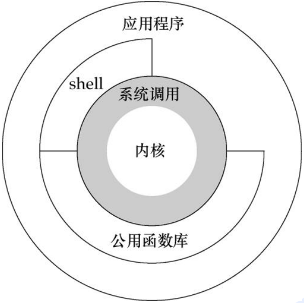
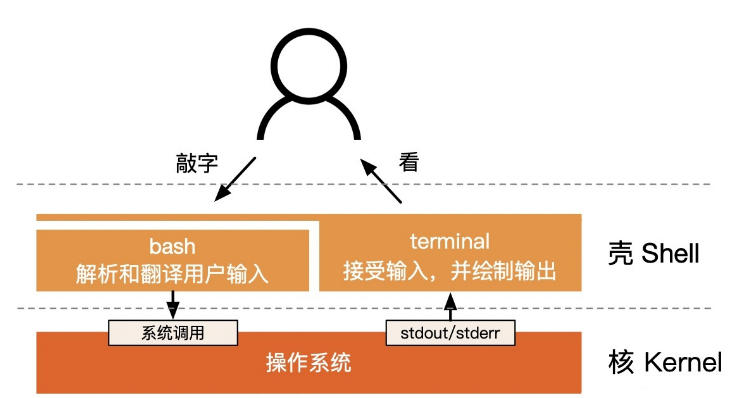

## 一张图片



Linux的系统结构如上图所示.


## 内核

前面已经学习过，内核是操作系统最核心的部分，它包含了且仅包含Linux操作系统最核心的功能，包括 `管理进程` 、`管理内存` 、`管理驱动` 、`管理文件` 、`管理网络` 等.


## shell

shell，中文意思是 `壳` ，即在Linux内核的外面套上一层外壳，你可以把它看作一个命令解释程序，用于接受用户输入的命令，经过翻译后，再交给内核去执行，例如：

```shell
# cat命令，调用的是Linux内核的open()函数和read()函数.
cat -> open()、read()
```

这样做有以下两个好处：

1. 简化操作
2. 安全

输入下面命令，查看当前使用的shell：

```shell
echo $SHELL
```

输入如下命令，查看当前Linux有哪些可以使用的shell：

```shell
cat /etc/shells
# or
chsh -l
```

输入如下命令，将默认使用的shell改为 `/bin/sh` ，需要重启后才能生效：

```shell
chsh -s /bin/sh
```

当然，不仅仅Linux操作系统有命令解释程序shell，Windows操作也有命令解释程序，例如 `cmd` 、`PowerShell` .

一张图片，加强记忆：




## shell编程

刚才已经了解了，shell是命令解释程序，用于翻译用户输入的命令，再交给内核执行，但面对复杂的任务，一行一行地输入命令会很繁琐，因此，就有了shell编程，它有自己的编程语法规则，能通过分支结构、循环结构等配合Linux命令完成复杂的任务，当然，这一系列复杂操作，同样是由命令解释程序翻译后再转交给内核执行的.

案例：

```shell
#!/bin/bash
echo "Hello World !"
```


## Linux文件系统

在Linux中，一切皆文件，意思是说，在Linux操作系统中，一切都可以通过文件的方式进行访问，包括内存、硬盘、外部设备等.

Linux操作系统的目录如下：

```shell
bin  boot  dev  etc  home  lib  lib64  media  mnt  opt  proc  root  run  sbin  srv  sys  tmp  usr  var
```

各目录的作用简要概括如下表：

| 目录  | 作用                                                         |
| ----- | ------------------------------------------------------------ |
| bin   | 存放普通用户可以执行的命令                                   |
| sbin  | 存放只有root用户才可以执行的命令                             |
| boot  | 包含内核文件和Linux开机所需要的文件                          |
| dev   | 设备目录，所有的硬件设备都放置在这个目录中，例如磁盘、CPU、内存 ... |
| etc   | 存放各种配置文件的目录，例如/etc/resolv.conf是DNS配置文件、/etc/sysconfig/network-script/ifcfg是网卡配置文件 |
| lib   | 库文件目录，bin和sbin中命令执行所需要的库文件，类似于Windows中的DLL |
| media | 可移除设备挂载目录，U盘、移动硬盘等会挂放在这个目录下        |
| mnt   | 用户临时挂载的其它文件系统                                   |
| opt   | 第三方软件安装目录，现在习惯性安装在/usr/local中             |
| proc  | 虚拟文件系统，这个目录的内容不在硬盘上，而在内存中，是系统内存的映射，可以访问这个目录的文件来获取系统信息，例如cat /proc/version获取Linux内核版本 |
| root  | root用户的主目录                                             |
| home  | 普通用户的主目录                                             |
| run   | 临时文件系统，存储系统启动以来的信息，如果系统重启，这个目录下的文件将被删除，/var/run目录指向/run |
| tmp   | 存放临时文件的目录，所有用户对该目录均可读写(可以作为安全渗透的突破口) |
| usr   | 应用程序放置目录，例如mysql、redis等服务，通常存放在/usr/local目录下 |
| var   | 存放系统运行过程中经常改变的文件，例如系统日志存放在/var/log目录下 ... |

