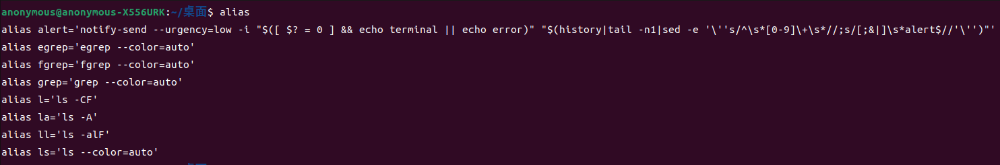
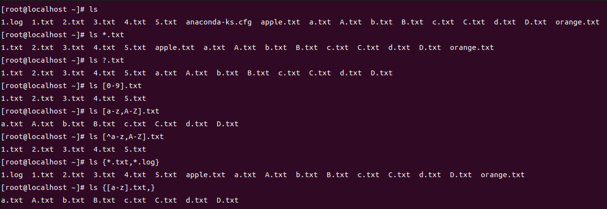

## 命令帮助

当我们不知道如何去使用一个新的Linux命令时，可以通过命令查看帮助，主要有以下两种方式：

1. -h 或 --help 参数

   我们可以把每一个Linux命令看成一个工具，这个工具有一些参数选项，-h或--help就是这样的参数选项，通过这两个选项可以查看到这个命令的作用以及各个参数的用途和使用方法.

   例如：

   ```shell
   [root@localhost ~]# ifconfig --help
   Usage:
     ifconfig [-a] [-v] [-s] <interface> [[<AF>] <address>]
     [add <address>[/<prefixlen>]]
     [del <address>[/<prefixlen>]]
     [[-]broadcast [<address>]]  [[-]pointopoint [<address>]]
     [netmask <address>]  [dstaddr <address>]  [tunnel <address>]
     [outfill <NN>] [keepalive <NN>]
     [hw <HW> <address>]  [mtu <NN>]
     [[-]trailers]  [[-]arp]  [[-]allmulti]
     [multicast]  [[-]promisc]
     [mem_start <NN>]  [io_addr <NN>]  [irq <NN>]  [media <type>]
     [txqueuelen <NN>]
     [[-]dynamic]
     [up|down] ...
   
     <HW>=Hardware Type.
     List of possible hardware types:
       loop (Local Loopback) slip (Serial Line IP) cslip (VJ Serial Line IP) 
       slip6 (6-bit Serial Line IP) cslip6 (VJ 6-bit Serial Line IP) adaptive (Adaptive Serial Line IP) 
       ash (Ash) ether (Ethernet) ax25 (AMPR AX.25) 
       netrom (AMPR NET/ROM) rose (AMPR ROSE) tunnel (IPIP Tunnel) 
       ppp (Point-to-Point Protocol) hdlc ((Cisco)-HDLC) lapb (LAPB) 
       arcnet (ARCnet) dlci (Frame Relay DLCI) frad (Frame Relay Access Device) 
       sit (IPv6-in-IPv4) fddi (Fiber Distributed Data Interface) hippi (HIPPI) 
       irda (IrLAP) ec (Econet) x25 (generic X.25) 
       infiniband (InfiniBand) eui64 (Generic EUI-64) 
     <AF>=Address family. Default: inet
     List of possible address families:
       unix (UNIX Domain) inet (DARPA Internet) inet6 (IPv6) 
       ax25 (AMPR AX.25) netrom (AMPR NET/ROM) rose (AMPR ROSE) 
       ipx (Novell IPX) ddp (Appletalk DDP) ec (Econet) 
       ash (Ash) x25 (CCITT X.25)
   ```

2. man手册

   man手册本身是一个命令，用于查看其它命令的使用手册，man命令提供的帮助信息会更加详细和全面.

   使用方法：

   ```shell
   # man [命令]
   man ifconfig
   ```

   快捷键及作用：

   | 快捷键         | 作用                       |
   | -------------- | -------------------------- |
   | 空格/page down | 查看命令手册的下一页       |
   | page up        | 查看命令手册的上一页       |
   | home           | 查看命令手册的首页         |
   | end            | 查看命令手册的尾页         |
   | /关键词        | 从上至下查找关键词         |
   | ?关键词        | 从下至上查找关键词语       |
   | n              | 定位到下一个搜索到的关键词 |
   | N              | 定位到上一个搜索到的关键词 |
   | q              | 退出帮助手册               |

   man命令查看的命令手册是实际存储在磁盘上的，位于 `/usr/share/man` 目录下，这个目录下的都是一些压缩文件，使用man手册的过程就是找到对应的压缩文件并解压显示到终端的过程.

   

3. -h/--help 和 man 的区别

   - -h/--help是命令的内置参数，而man本身就是一个命令

   - -h/--help提供的比较简单，man命令提供的更加详细
   - -h/--help提供了各个参数的使用案例，而man没有提供
   - -h/--help一定可以查询得到，但是man手册不一定，如果/usr/share/man目录下的内容被删除了，通过man手册将查询不到任何帮助信息


## 别名-alias

别名的作用，就是为一些复杂且常用的命令起一个简要的名字，方便使用和记忆.

1. 使用如下命令，查看Linux操作系统中当前用户可以使用的所有别名：

   ```shell
   alias
   ```

   

2. 自定义别名

   Linux操作系统是一个多用户操作系统，每个用户都可以定义自己的命令别名，方法就是编辑 `~/.bashrc` 文件，这是一个位于用户主目录下的隐藏文件.

   配置方法及案例如下：

   ```shell
   # alias 别名='命令1;命令2...'
   alias anonymous='ip route show;ping -n www.baidu.com -c 4'
   ```

   配置之后，需要执行下面命令才能生效：

   ```shell
   source ~/.basnrc
   ```

   

3. 删除别名

   - 编辑 `~/.bashrc` 文件，删除别名所在的那一行
   - 执行 `source ~/.bashrc` 
   - 重启Linux系统才能生效

4. 注意

   - 添加别名只要执行 `source` 命令即可生效，删除别名需要 `重启` 才能生效.
   - 别名只对当前用户有效，其它用户如果没有配置相应的别名则无法使用.
   - 别名一定要见名知意，且不能和原有系统命令相冲突
   - 注意恶意别名带来的安全问题，例如为 `rm -rf /*` 建立别名


## 通配符

以 `ll` 命令作为背景.

首先，概括如下：

| 符号 | 含义                                                         |
| ---- | ------------------------------------------------------------ |
| *    | 匹配一个或多个任意字符                                       |
| ?    | 匹配一个任意字符                                             |
| []   | 匹配一个在一定范围内的字符，如有多个范围使用逗号隔开，且这些范围必须是有意义的，例如0-9、a-z、A-Z等 |
| {}   | 匹配多项，如果只有一项，末尾需要添加逗号                     |
| ^    | 取反                                                         |

测试案例如下图：




## history

1. 认识

   我们在使用Linux系统的过程中，会执行很多的命令，在默认情况下，这些使用过的命令会形成缓存，且这些缓存是以 `连接` 为单位的(包括本地连接和远程连接)，当建立一个连接时，会从建立连接的用户的 `~/.bash_history` 文件中读取所有的命令形成一个独立的缓存，在连接的过程中，该用户执行过的所有命令都会追加到相应的独立缓存中，当连接断开时，所有追加的命令缓存会被追加写入到 `~/.bash_history` 文件中. 正是因为有了命令缓存，我们在使用Linux的过程中，才可以通过上下箭头快速切换历史命令.

2. 命令

   通过下面命令，可以查看当前连接的命令缓存：

   ```shell
   history
   ```

   通过下面命令，可以查看当前用户执行过的所有命令，不包括本次连接：

   ```shell
   cat ~/.bash_history
   ```

   通过下面命令，可以清除当前连接所有的命令缓存：

   ```shell
   history -c
   ```

   通过下面命令，可以清除当前连接中指定编号的命令缓存：

   ```shell
   history -d 编号
   ```

   通过下面命令，可以从磁盘上清除该用户执行过的所有命令，不包括本次连接：

   ```shell
   echo "" > ~/.bash_history
   ```

   通过下面命令，可以将当前连接的命令缓存覆盖写入到指定文件中，如果没有指定，默认就是 `.bash_history` 文件：

   ```shell
   history -w [文件名]
   ```

   通过下面命令，可以将当前连接的命令缓存追加写入到指定文件中，如果没有指定，默认就是 `.bash_history` 文件：

   ```shell
   history -a [文件名]
   ```

   通过下面命令，可以从指定文件中读取历史命令追加到当前连接的命令缓存中，如果没有指定，默认就是 `.bash_history` 文件：

   ```shell
   history -r [文件名]
   ```

   通过下面命令，可以伪造一条没有执行过的命令到当前连接的命令缓存中：

   ```shell
   history -s 命令
   ```

   

3. 环境变量与配置文件

   - 环境变量

     - `HISTCONTROL` ：这个变量主要有三个可能取值，当取值为ignorespace时，便不会将以空格开头的命令记录到缓存中；当取值为ignoredups时，在缓存中不会记录连续重复执行的命令；当取值为ignoreboth时，满足ignorespace和ignoredups两种情况，默认取值是 `ignoredups` .

       

     - `HISTFILE` ：这个变量是历史命令的默认存储文件，默认取值是 `~/.bash_history` .

       

   - 配置文件

     通过配置文件，可以修改 `HISTCONTROL` 和 `HISTFILE` 这两个变量的取值.

     - `/etc/profile` 

       这个文件配置的变量是系统变量，对所有的用户都会生效.

       ```shell
       # /etc/profile文件中关于history相关部分
       HISTSIZE=1000
       HISTCONTROL="ignorespace"
       if [ "$HISTCONTROL" = "ignorespace" ] ; then
           export HISTCONTROL=ignoreboth
       else
           export HISTCONTROL=ignoredups
       fi
       
       export PATH USER LOGNAME MAIL HOSTNAME HISTSIZE HISTCONTROL
       ```

       修改后，需要 `source /etc/profile` 才生效.

     - `~/.bash_profile` 

       这个文件配置的变量是用户变量，只对当前用户生效，但是优先级高于系统变量.

       ```shell
       # .bash_profile
       
       # Get the aliases and functions
       if [ -f ~/.bashrc ]; then
       	. ~/.bashrc
       fi
       
       # User specific environment and startup programs
       
       PATH=$PATH:$HOME/bin
       HISTCONTROL="ignoredups"
       
       export PATH HISTCONTROL
       ```

       修改后，同样需要 `source ~/bash_profile` 才生效.


## 环境变量

环境变量有两大类：用户变量和系统变量.

系统变量配置在 `/etc/profile` 文件中，对所有用户都生效.

环境变量配置在 `~/bash_profile` 文件中，只对当前用户生效，但是优先级高于系统变量.

查看全部环境变量：

```shell
# env
env
```

查看指定名称的环境变量：

```shell
# echo $环境变量名
echo $HISTCONTROL
```


