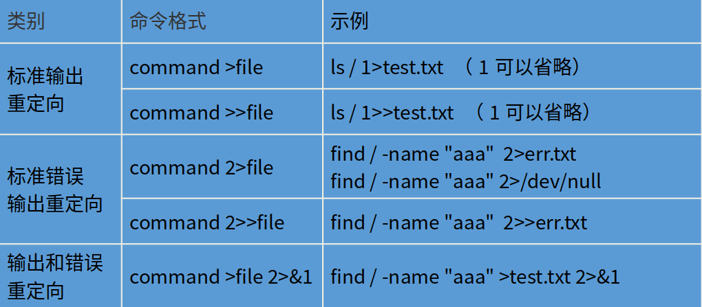

## 文件描述符

Linux操作系统有三种文件描述符，如下图：

即默认从键盘读取输入、默认将结果和错误信息输出到屏幕显示器.

## 重定向

所谓重定向，就是改变输入、输出以及错误输出的方向，即不再从键盘读取输入，也不再将结果和错误信息输出到屏幕显示器，而是从指定文件中读取输入以及将结果和错误信息输出到指定文件中.

文件描述符有三种，相应的，重定向也有三种，如下表：

| 重定向 | 符号    | 说明                                                         |
| ------ | ------- | ------------------------------------------------------------ |
| 输入   | 0<或0<< | 输入重定向，0可以省略，<表示覆盖，<<表示追加                 |
| 输出   | 1>或1>> | 输出重定向，1可以省略，>表示覆盖，>>表示追加                 |
| 错误   | 2>或2>> | 错误重定向，2不可以省略，>表示覆盖，>>表示追加               |
| 其它   | >&或&>  | 表示将一个流(stream)重定向到另一个文件描述符(file descriptor) |

错误、输出重定向案例，如下图：

输出重定向案例，如下图：

