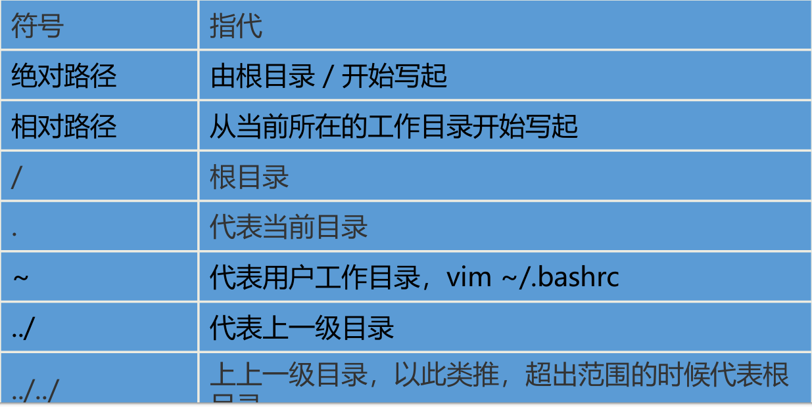
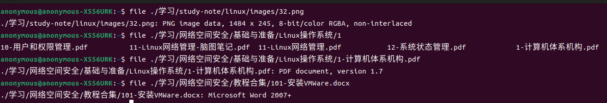
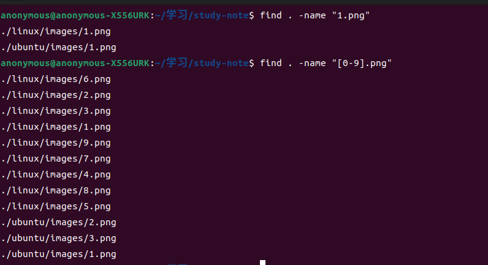
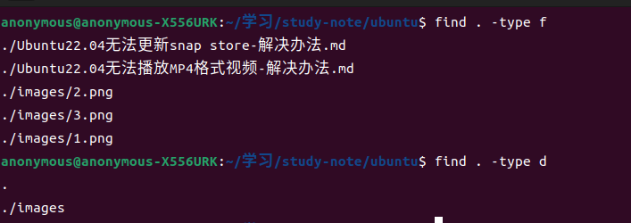
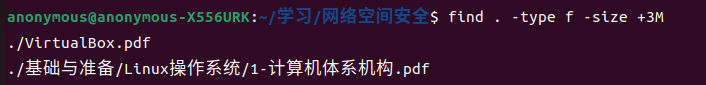
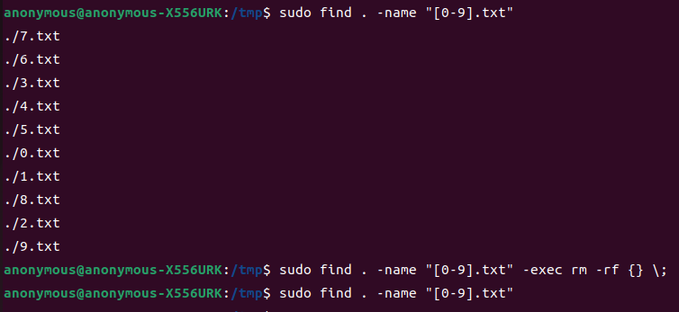
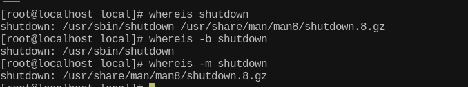
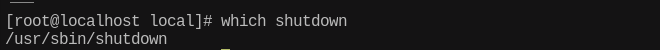
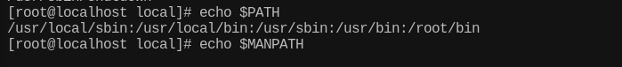

## Linux命令大全

[Linux命令大全](https://www.linuxcool.com/)


## 列出目录内容和属性

1. 命令格式

   ```shell
   ls 选项 文件名/目录名
   ```

2. 常用参数和别名

   - 参数

     ```shell
     -a 不隐藏任何以 . 开始的项目
     -A 列出除 . 及 .. 以外的任何项目
     --block-size 将文件大小以此处给定的大小为单位进行缩放
     -C 每栏由上至下列出项目，默认效果
     -F 加上文件类型的指示符号（*/=@| 其中一个）
     -l 使用较长格式列出信息，包含文件的属性与权限等等数据
     -S 根据文件大小降序排序
     -t 按时间排序，最新的最前
     ```

   - 别名

     ```shell
     alias l='ls -CF'
     alias la='ls -A'
     alias ll='ls -alF'
     alias ls='ls --color=auto'
     ```


## 工作目录

1. 查看工作目录

   ```shell
   # print working directory
   pwd
   ```

2. 切换工作目录

   ```shell
   # cd change directory 相对路径或者绝对路径
   cd
   ```

   


## 查看文件类型

直接看案例即可，如下图：




## 创建目录

```shell
mkdir [-p] 目录名
```

mkdir默认只能创建单级目录，使用 `-p` 参数可以创建多级目录.


## 创建文件

```shell
touch 1.txt
vi 1.txt
vim 1.txt
gedit 1.txt
```


## 复制文件或目录

命令：

```shell
cp [参数] 源文件/目录 目标文件/目录
```

参数：

| 参数 | 说明                                                   |
| ---- | ------------------------------------------------------ |
| -f   | 强制，若目标文件已经存在，则移除后再尝试一次           |
| -i   | 若目标文件已经存在时，在覆盖时会先询问动作的进行(常用) |
| -r   | 递归持续复制，用于目录的复制行为(常用)                 |
| -p   | 连同文件的属性一起复制过去                             |


## 删除目录或文件

命令：

```shell
rm [参数] 文件/目录
```

参数：

| 参数 | 说明                                                 |
| ---- | ---------------------------------------------------- |
| -f   | 不询问，强制删除，忽略不存在的文件，不会出现警告信息 |
| -i   | 互动模式，在删除前会询问使用者是否确认删除，推荐     |
| -r   | 递归持续删除，用于目录的删除行为，危险!              |


## 移动文件或目录

命令：

```shell
mv [参数] 源文件/目录 目标文件/目录
```

参数：

| 参数 | 说明                                           |
| ---- | ---------------------------------------------- |
| -f   | 强制，如果目标文件已经存在，不会询问而直接覆盖 |
| -i   | 若目标文件已经存在时，就会询问是否覆盖         |
| -r   | 递归持续移动，适用于目录的移动行为             |

移动到相同目录下，就相当于 `重命名` .


## 查找文件或目录

命令：

```shell
find 开始目录 选项 名字
```

- 开始目录：即从哪个目录开始，递归查找
- 选项：按什么条件进行查找，名字 or 文件类型 or 文件大小
- 名字：文件名，可以使用通配符

选项：

1. 按名字进行查找 -name



2. 按文件类型进行查找 -type



3. 按文件大小进行查找 -size

   +3M代表查找文件大小大于3M的文件，-3M则代表查找文件大小小于3M的文件.



4. 把查找到的文件或目录，作为参数，传递给另一条命令执行

   


## 其它查找命令

1. whereis

   ```tex
   whereis locates the binary, source and manual files for the specified command names. whereis then attempts to locate the desired program in the standard Linux places, and in the places specified by $PATH and $MANPATH.
   
   whereis定位指定命令的二进制文件、源文件、帮助手册的存储位置. whereis会在标准Linux位置以及环境变量PATH和MANPATH指定的路径下查找.
   
   OPTIONS
          -b     Search only for binaries.
   
          -m     Search only for manuals.
   
          -s     Search only for sources.
   
   参数：
   	   -b     只查找指定命令的二进制文件
   	   -m     只查找指定命令的帮助手册
   	   -s     只查找指定命令的源文件
   ```

   

2. which

   ```tex
   Which takes one or more arguments. It does this by searching for an executable or script in the directories listed in the environment variable PATH using the same algorithm as bash(1).
   
   which需要一个或多个参数. 它通过一定的算法在环境变量PATH中列出的目录中搜索可执行文件或脚本.
   ```

   

3. $PATH和$MANPATH

   


## 链接

1. 硬链接

   - 只能给文件创建硬链接，不能给目录创建硬链接.
   - 硬链接不能跨文件系统.
   - 硬链接相当于源文件的副本，占用实际的存储空间.
   - 硬链接和源文件的访问是等同的，且删除其中一个对另一个没有影响.

2. 软链接

   - 即可以给文件创建软链接，也可以给目录创建软链接.
   - 软链接可以跨文件系统.
   - 软链接是符号链接，可以看作是Windows操作系统中的快捷方式，只占用极少极少的存储空间.
   - 软链接和源文件的访问也是等同的，但删除源文件会造成软链接失效.

3. 命令

   ```shell
   ln [参数] 源文件/目录 链接文件/目录
   ```

4. 参数

   - -f：强制，若链接文件/目录已存在，先删除，再创建.
   - -i：询问，若链接文件/目录已存在，询问用户是否选择覆盖.
   - -s：创建软链接，如果没有这个参数，创建的链接默认是硬链接.
   - -v：显示详细的处理过程.

