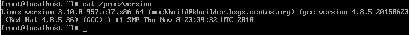
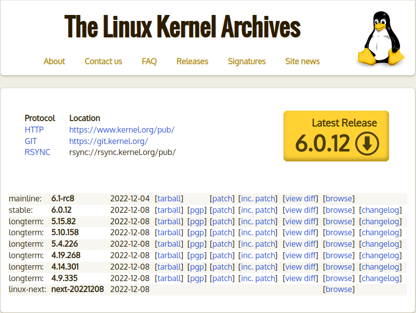
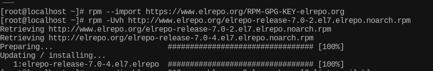
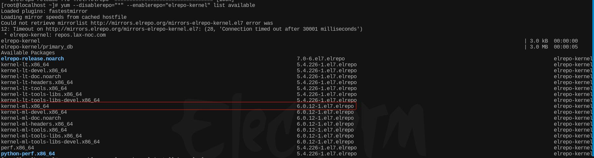
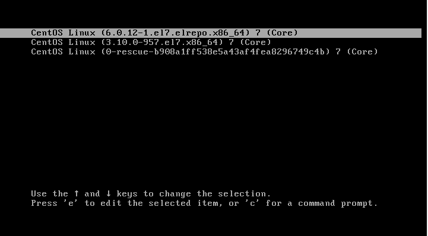
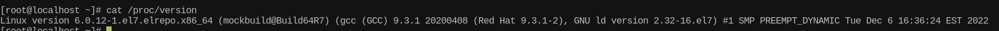

## 为什么要升级内核版本

内核是Linux操作系统最核心的部分，它具备Linux操作系统最核心的功能，包括设备驱动、内存管理、进程管理等，在内核的基础上，安装各种各样的软件和第三方库就成为了各种发行版本，那么想象一下，如果某个内核的版本出现了安全漏洞，那么所有基于这个内核版本的发行版本就都存在风险，此时，就必须进行内核的升级以避免网络安全问题，另一方面，内核也是在不断优化的，更新内核，能提升我们计算机的性能和使用体验.


## 查看当前CentOS7-x64的内核版本

命令：

```shell
cat /proc/version
```




## 查看当前最新版本的内核

访问Linux内核的官网：https://www.kernel.org/



可以看到，最新稳定的内核版本是 `6.0.12` .


## 将CentOS7-x64的内核升级至官方最新版本

在CentOS中，提供了yum软件包管理工具，通过yum可以从官方镜像源中下载或更新软件包并安装至本地仓库，但是，这样做只能升级到官方仓库的最新内核版本，无法升级到内核官网发布的最新版本，要想升级到内核官网发布的最新版本，就需要启动第三方仓库：`ELRepo` 

1. 输入以下两条命令启用ELRepo仓库

   ```shell
   rpm --import https://www.elrepo.org/RPM-GPG-KEY-elrepo.org
   ```

   ```shell
   rpm -Uvh http://www.elrepo.org/elrepo-release-7.0-2.el7.elrepo.noarch.rpm
   ```

   运行结果：

   

   第三方仓库ELRepo启用成功.

2. 查看第三方仓库ELRepo上所有可用的内核安装包

   命令：

   ```shell
   yum --disablerepo="*" --enablerepo="elrepo-kernel" list available
   ```

   

   如上图，可以看到最新主线版的稳定内核(ml代表最新主线版，lt代表长期支持版)，和从内核官网看到的 `6.0.12` 版本一致.

3. 从第三方仓库ELRepo上安装最新主线版本的内核

   命令：

   ```shell
   yum --enablerepo=elrepo-kernel install kernel-ml
   ```

4. 重启计算机，选择最新版本的内核

   重启计算机过程中，会提示选择内核版本，可以看到我们刚才更新的最新内核版本，选择该内核版本，如下图：

   

   再次输入命令查看内核版本：

   ```shell
   cat /proc/version
   ```

   

   从上图可以看到，Linux内核版本已经更新到 `6.0.12` 的最新稳定版本了，同时，gcc编译器的版本也升级为了 `9.3.1` (原先的版本是4.8.5，不需要再单独升级gcc的版本了).

5. 设置最新内核版本为默认启动选项

   要将最新内核版本设置为默认启动选项，需要修改GRUB配置，编辑 `/etc/default/grub` 文件，如下：

   ```shell
   GRUB_TIMEOUT=5
   GRUB_DISTRIBUTOR="$(sed 's, release .*$,,g' /etc/system-release)"
   GRUB_DEFAULT=0
   GRUB_DISABLE_SUBMENU=true
   GRUB_TERMINAL_OUTPUT="console"
   GRUB_CMDLINE_LINUX="crashkernel=auto rd.lvm.lv=centos/root rd.lvm.lv=centos/swap rhgb quiet"
   GRUB_DISABLE_RECOVERY="true"
   ```

   修改 `GRUB_DEFAULT` 的属性值为0，意思是将GRUB初始化页面的第一个内核作为默认内核.

   最后，输入下面命令，让刚才的配置修改生效：

   ```shell
   grub2-mkconfig -o /boot/grub2/grub.cfg
   ```

6. 验证

   再次重启计算机，如下图：

   

   可以看到，最新内核版本已经被默认选中了.

