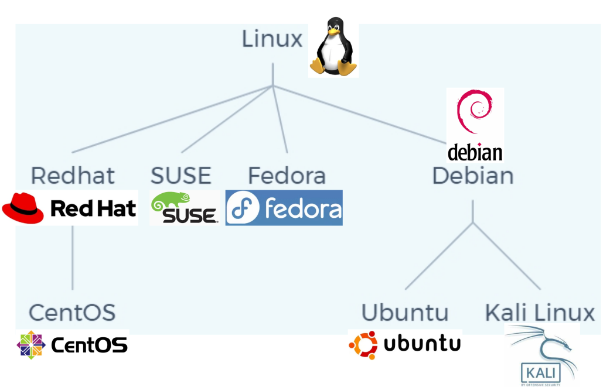
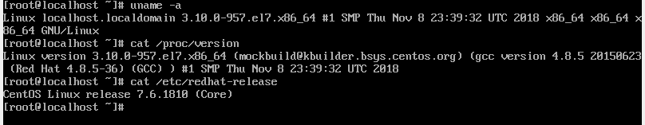

## Linux的由来

Linux，全称是 `Linux is not unix` ，即Linux不是Unix.

Unix是一个极具意义的操作系统，最开始一直开源免费，广泛应用于服务器，直到Unix Version 7版本，Unix不再开源且收费，为此，Andrew S. Tanenbaum写了一个迷你版的Unix操作系统，名为Minix(mini-Unix)，而Linus Benedict Torvalds这个天才程序员又在Minix的基础上写了跨时代意义的第一个Linux操作系统GNU/Linux，之所以称为GNU，是因为该操作系统上使用了原先在Unix系统上的GNU工具集.

Linux与Unix系统的区别：

1. Linux操作系统是类Unix系统，但不是Unix操作系统的分支.
2. Linux系统开源免费，Unix商业收费
3. Linux系统的硬件兼容性优于Unix.


## Linux的分支

Linux操作系统的主流分支如下图所示：



RedHat系列分支主要应用于服务器端，是付费的，而其子分支CentOS操作系统是开源免费的，CentOS7去除了RedHat的收费项目.

Debain系列分支主要应用与个人用户操作系统，其中，Ubuntu操作系统抢占了部分原先Windows的用户(安全或者性能的原因)，而Kali Linux则是渗透测试人员专用的操作系统.

更多Linux操作系统的分支：https://upload.wikimedia.org/wikipedia/commons/1/1b/Linux_Distribution_Timeline.svg


## Linux内核与发行版

1. Linux内核

   Linux内核，仅具备Linux操作系统最核心部分的功能，包括设备驱动、文件管理、进程管理、网络通信 ...

   Linux内核具备一个版本号，以便用户可以单独进行更新，可以通过如下两条命令查看Linux内核的版本号：

   ```shell
   uname -a
   ```

   ```shell
   cat /proc/version
   ```

   查询结果：

   

   可以看到，当前Linux内核的版本号是 `3.10.0-957.el7.x86_64` ，其中：

   - 3：主版本号.
   - 10：次版本号.
   - 0：修订版本号.
   - 957：发行版本的补丁版本号.
   - el7：正在使用的内核是RedHat7/CentOS7系列发行版本的专用内核.
   - x86_64：可以使用64位的CPU.

   更多关于Linux内核，请访问：https://www.kernel.org/

   一旦Linux内核出现漏洞，该内核版本的所有发行版本都会受到影响，甚至很多安卓手机也会受到影响，因为安卓使用的也是Linux内核.

   内核漏洞查询：https://www.cvedetails.com/vulnerability-list/vendor_id-33/product_id-47/Linux-Linux-Kernel.html

2. Linux发行版

   在Linux内核的基础上，安装上其它的一些辅助功能的软件，就成为了一个发行版本，可以通过下面命令查看Linux系统的发行版本(RedHat系列)：

   ```shell
   cat /etc/redhat-release
   ```

   查询结果：

   

3. 有漏洞怎么办

   - Linux内核有漏洞：更新内核
   - Linux发行版本有漏洞：打补丁
