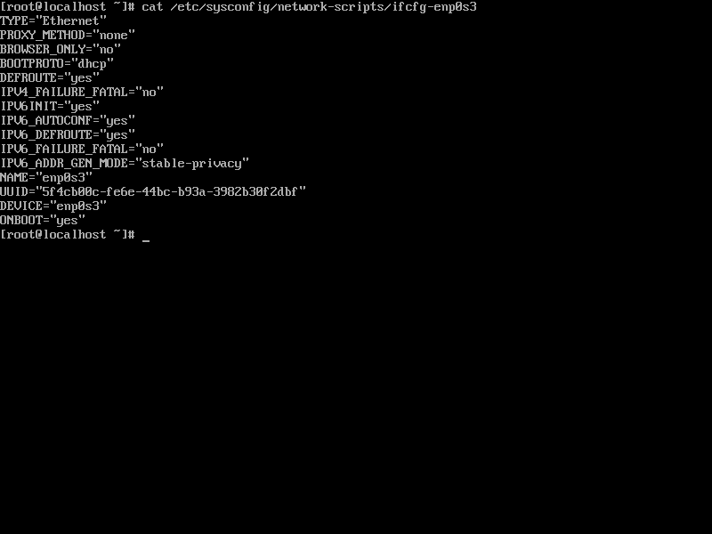

## 我的环境

操作系统：Ubuntu 22.04


## 下载并安装VirtualBox

下载地址：https://download.virtualbox.org/virtualbox/7.0.4/virtualbox-7.0_7.0.4-154605~Ubuntu~jammy_amd64.deb

输入如下命令进行安装：

```shell
sudo dpkg -i virtualbox-7.0_7.0.4-154605~Ubuntu~jammy_amd64.deb
```

这里为什么我选择VirtualBox呢？一是因为它开源免费(VMware闭源收费)，二是因为它体积小(相对VMware)，三是因为想尝鲜(VMware之前用过了).

安装完成后，VirtualBox的图标如下(第二行左数第一个)：


## 通过VirtualBox新建虚拟机

首先，点击 `新建` 按钮，如下图：


接着，按如下图填写信息：


其中，Name是你要给虚拟机起的名字(我取名为CentOS7-x64，见名知义)，Folder是你要将虚拟机安装到哪个目录下(这里我安装到用户主目录下的VirtualBox-VMs文件夹中，方便查找和管理)，ISO Image是选择操作系统的镜像文件(链接: https://pan.baidu.com/s/1mzVqoWuuSSj9oEtGDzRcBQ 提取码: v9ae)，把Skip Unattended Installation的勾选上(手动安装客户端操作系统)，点击Next.

接着，为虚拟机分配内存和处理器，如下图：


默认即可(2G内存，1个CPU)，点击Next.

再接着，为虚拟机分配硬盘空间，如下图：


默认即可(20G磁盘空间)，不要勾选Pre-allocate Full Size，否则会一次性失去20G的磁盘空间，点击Next.

如下图：


从摘要中可以看到虚拟机的操作系统、内存、处理器、磁盘等信息，最后点击Finish.

到这里，虚拟机就创建完成了.


## 完成CentOS7-x64的安装

上一步骤完成后，只是新建了虚拟机，并没有完成安装过程，右键选中该虚拟机，选择正常启动，如下图：


默认选中Install CentOS 7，按下enter键，如下图：


在安装过程中，选择中文引导，点击继续，如下图：


以下信息默认即可，需要注意的是软件安装选择最小安装方式即可(作为服务器使用，不需要安装GUI界面和浏览器等各种软件)，点击开始安装，如下图：


现在就进入安装过程了，在这个过错中，可以为root用户设置密码，还可以创建一个新的普通用户，如下图：


最后，安装完成，点击重启，如下图：


重启后，输入用户名和密码完成登陆(密码输入过程中是隐式的，尽管输入即可)，如下图：


至此，CentOS7-x64虚拟机就安装完成了.


## 网络和启动配置

`系统-启动顺序` 选择硬盘(从硬盘启动)，`网络-网卡1` 选择桥接网络(与物理主机处于同一网络下).


至此，网络和启动配置完成.


## 安装ifconfig

因为刚才的安装过程中采用的是最小安装，所以没有ifconfig命令，需要输入以下命令进行安装：

```shell
yum install -y net-tools
```

安装完成后，就可以使用ifconfig命令来查看虚拟机CentOS7-x64的IP地址了，如下：


其中，enp0s3是网卡的名字，该网卡有一个相应的配置文件 `/etc/sysconfig/network-scripts/ifcfg-enp0s3` ，它的内容如下：


