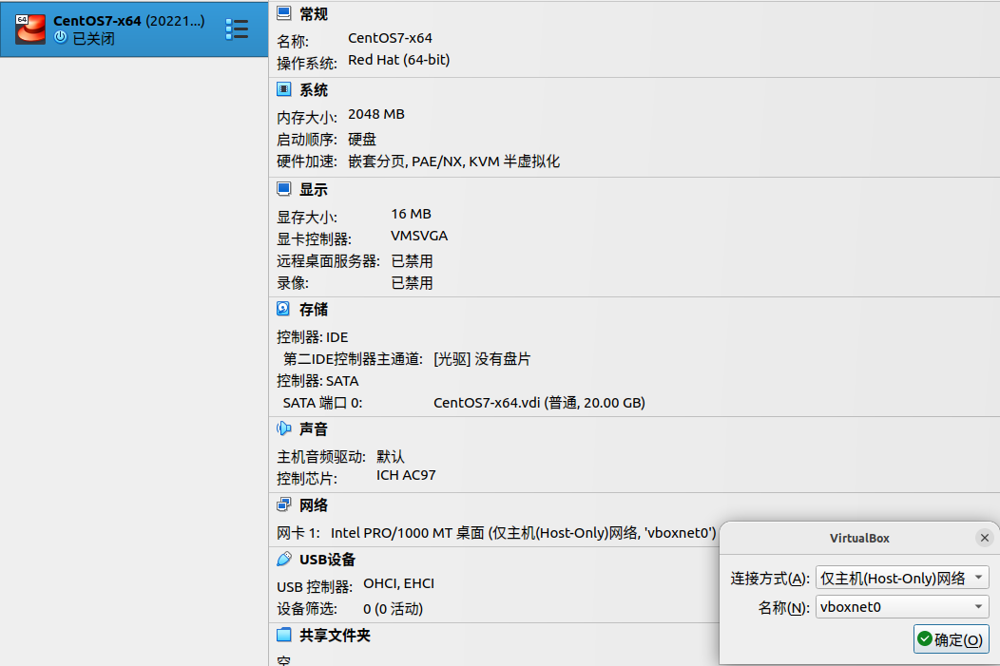

## VirtualBox的网络模式

VirtualBox不同于VMWare，它提供了不仅三种网络模式，；包括 `Bridged` 、`NAT` 、`NATServer` 、`Host-only` 、`Internal` 五种网络模式，这五种网络模式在宿主机、虚拟机、外部网络三者之间的连通状况如下所示：

其中，`+` 代表可以连通，`âĂŞ` 代表无法连通，`Port forward` 代表需要配置端口转发之后才可以连通.

但是，和VMWare一样，最常用的只有三种：`Bridged` 、`NATServer` 、`Host-only` .

## Bridged

1. 认识

   Bridged，是桥接网络模式，处于桥接网络模式下的所有虚拟机和宿主机处于同一个网络下，这个网络就是宿主机所在的网络，所有的虚拟机都占用一个公网IP.

2. 连通情况

   - 虚拟机和虚拟机之间可以相互连通.
   - 宿主机和虚拟机之间可以相互连通.
   - 可以访问互联网.
   - 其它主机可以访问虚拟机.

3. 配置

   

   如上图，连接方式选择桥接网卡，名称根据你宿主机所在的网络决定.(wlp3s0是有线网卡，enp2s0是无线网卡，如果宿主机所处网络是无线网络就选择无线网卡enp2s0，否则选择有线网卡wlp3s0).

4. 使用场景

   创建一个虚拟服务器在内网提供网络服务.

## NATServer

1. 认识

   NATServer，即网络地址转换模式，处于NATServer网络模式下的所有虚拟机处于同一个局域网下，宿主机不处于该局域网下(相当于外部网络)，虚拟机不占用公网IP，可以访问互联网，但是在外部主机看来，会认为是宿主机发起的访问.

2. 连通情况

   - 虚拟机和虚拟机之间可以相互连通.
   - 虚拟机可以连通宿主机，宿主机无法连通虚拟机.
   - 可以访问互联网.
   - 其它主机不可以访问虚拟机(宿主机可以通过配置端口转发进行访问，其它主机需要通过共享网络进行访问).

3. 配置

   

   如上图，连接方式选择NAT网络，名称选择要连接的局域网(这个局域网是自己配置的)，配置方式如下图：

   

   如上图，工具 - 网络 - NAT Networks - 创建，名称就是局域网的名字，IPv4 Prefix就是网段，Enable DHCP表示在该局域网中开启DHCP服务，在这个局域网中，DNS服务器默认是网关.

   上述配置无法实现宿主机访问虚拟机，若要实现，需要配置端口转发，配置如下图：

   

   即通过访问宿主机的2222端口，会把这个请求转发到虚拟机的22号端口，实现连通，在宿主机上连通测试如下：

   

   注：当CentOS7安装完成后，默认开启ssh服务和防火墙的22号端口.(与Ubuntu22.04不同，Ubuntu22.04默认关闭防火墙，且默认防火墙策略是允许所有的流出流量，禁止所有的流入流量).

   

4. 使用场景

   绝大多数情况.

## Host-only

1. 认识

   Host-only，即仅主机模式，处于Host-only模式下的所有虚拟机处于同一个局域网下，宿主机也处于这一个局域网下，虚拟机不占用公网IP，无法访问互联网.

2. 连通情况

   - 虚拟机和虚拟机之间可以相互连通.
   - 虚拟机和宿主机之间可以互相连通.
   - 无法访问互联网.
   - 其它主机无法访问虚拟机.

3. 配置

   

   如上图，连接方式选择仅主机(Host-Only)网络，名称选择要连接的局域网(这个局域网是自己配置的)，配置如下：

   

   工具 - 网络 - Host-only Networks - 创建 - Adapter，选择手动配置网卡，IPv4地址就是这个局域网分配给宿主机虚拟网卡的IP地址，同样的，Host-only网络模式也可以开启DHCP服务，如下：

   

   按提示配置好DHCP服务器的地址，以及分配的IP地址范围.

4. 使用场景

   创建一个与其它机器都隔离的网络.

