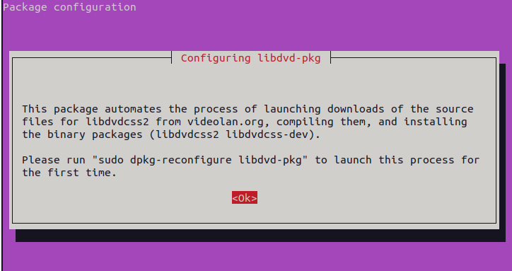

## 解决Ubuntu22.04无法播放mp4格式视频的办法

问题再现：


原因：系统中没有安装播放该视频需要的编码/解码器.

解决步骤：

1. 更新软件源列表

   ```shell
   sudo apt-get update
   ```

2. 安装视频播放器最常见的编码/解码器的软件包

   ```shell
   sudo apt-get install libdvdnav4 libdvd-pkg gstreamer1.0-plugins-bad gstreamer1.0-plugins-ugly libdvd-pkg
   ```

   安装过程中，需要我们对协议进行确认，按 `enter` 键即可：

   

   

3. 运行完成后，Ubuntu22.04应该就可以播放mp4格式的视频了，如果还是无法播放，重启计算机即可.